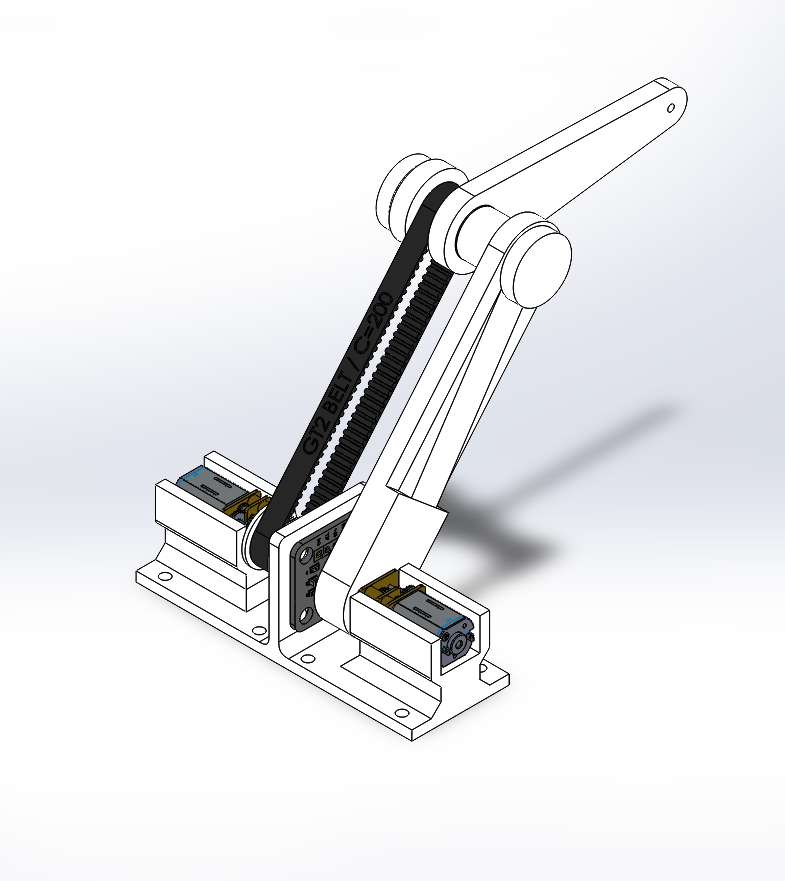
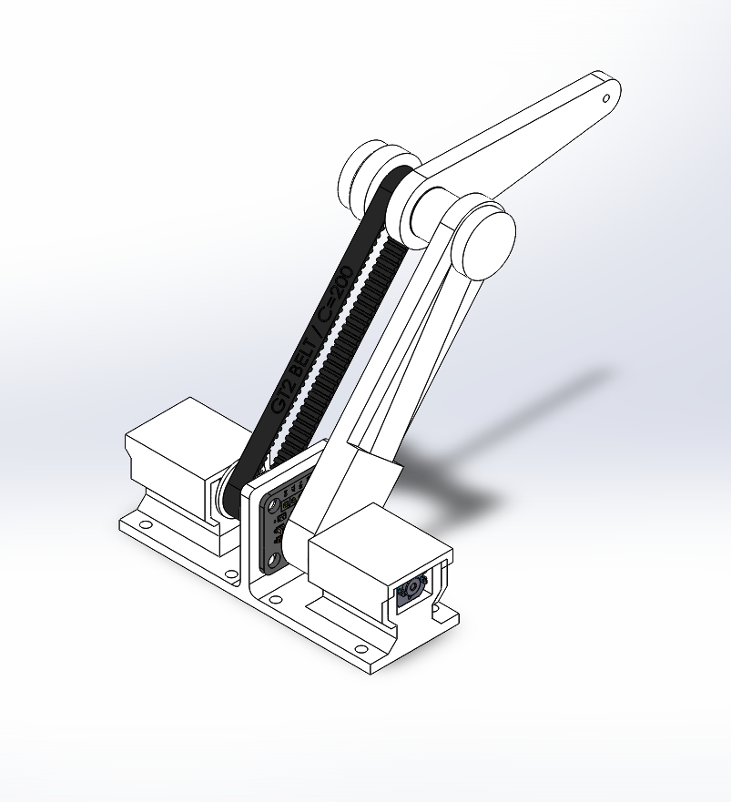
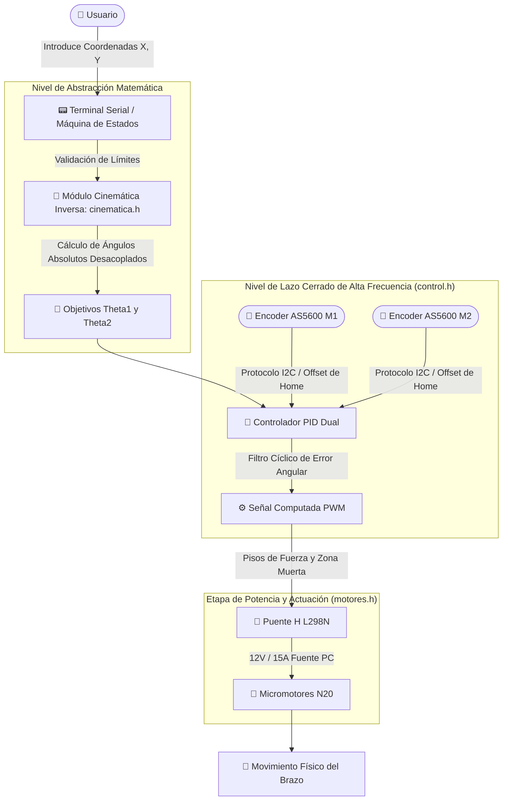

<div align="center">


<h2 align="center">Facultad de Ingeniería – Universidad Nacional de Lomas de Zamora</h2>

# 🤖 Manipulador Antropomórfico de 2 GDL con Transmisión Coaxial Diferencial

### Cátedra: Fundamentos de Robótica | Trabajo Integrador Final


</div>

---

## 📑 Índice

- [🧠 Descripción y Problemática](#-descripción-y-problemática)
- [📸 Galería y Diseño de Componentes](#-galería-y-diseño-de-componentes)
- [🚀 Arquitectura del Software](#-arquitectura-del-software)
- [🔌 Hardware y Esquema de Conexiones](#-hardware-y-esquema-de-conexiones)
- [📐 Cinemática Inversa y Desafíos de Control](#-cinemática-inversa-y-desafíos-de-control)
- [🛠️ Tecnologías Utilizadas](#️-tecnologías-utilizadas)
- [📂 Estructura del Repositorio](#-estructura-del-repositorio)
- [👤 Autores](#-autores)

---

## 🧠 Descripción y Problemática

Este repositorio contiene el desarrollo integral del firmware de control, modelado cinemático e ingeniería de empotramiento de un **manipulador robótico antropomórfico de 2 grados de libertad (GDL)** que opera en el plano vertical. El proyecto fue diseñado y ejecutado como Trabajo Integrador Final para la asignatura **Fundamentos de Robótica** en la carrera de Ingeniería de la **Universidad Nacional de Lomas de Zamora (UNLZ)**.

### 📋 La Consigna y Desafío Técnico
El objetivo principal consistía en desarrollar un brazo robótico capaz de posicionar su extremo (*end-effector*) en coordenadas cartesianas arbitrarias $(X, Y)$ ingresadas por terminal de manera precisa y repetitiva. 

El proyecto presentó desafíos mecánicos y de control avanzados debido a las siguientes restricciones físicas de hardware:
1. **Actuadores de Alta Relación de Reducción:** Se utilizaron micromotores de corriente continua N20 con trenes de reducción integrados, los cuales poseen una holgura mecánica (*backlash*) pronunciada.
2. **Dinámica No Lineal en el Plano Vertical:** El sistema lucha constantemente contra el torque variable impuesto por la gravedad, requiriendo un algoritmo de control robusto en tiempo real.
3. **Acoplamiento Mecánico por Correa Coaxial:** Para alivianar la estructura móvil, ambos motores se fijaron en la base del robot. El movimiento del codo (Eslabón 2) se transmite mediante poleas síncronas paralelas, lo que induce una dependencia cinemática diferencial directa entre el eje de la base y el eje del codo.

---

## 📸 Galería y Diseño de Componentes

El diseño estructural fue impreso íntegramente en 3D, optimizando las tolerancias para contener la etapa de potencia y sensado de forma compacta.

<div align="center">
  
  <br>
  <em>Vista explotada de los actuadores en la base fija y las poleas síncronas de transmisión coaxial.</em>
</div>

<br>

<div align="center">
  
  <br>
  <em>Vista externa con el Módulo de Retención y Bloqueo Axial (Cubre Motores) diseñado para absorber las fuerzas de tracción de las correas y eliminar juego estructural.</em>
</div>

---

## 🚀 Arquitectura del Software

El sistema operativo del firmware se diseñó bajo un paradigma modular para desacoplar el procesamiento analítico de las tareas críticas de control en tiempo real:



---

## 🔌 Hardware y Esquema de Conexiones

El sistema está alimentado por una fuente de alimentación conmutada de PC que provee una línea dedicada de **12V y hasta 15A de capacidad de corriente**, lo que asegura un suministro eléctrico óptimo libre de caídas de tensión cuando el PID demanda torque máximo para contrarrestar la fuerza de gravedad.

Todas las masas (`GND`) de la etapa lógica del ESP32, el puente H L298N y las placas de los codificadores magnéticos se unificaron para asegurar una referencia de señal común y mitigar el ruido electromagnético.

### Tabla de Conexiones e Interfaces de Datos

| Componente Asociado | Función Física | Tipo de Señal / Bus | Pin ESP32 |
| :--- | :--- | :--- | :---: |
| **Motor 1 (Base)** | Control de Velocidad (Habilitación ENA) | PWM Out | **GPIO 14** |
| **Motor 1 (Base)** | Dirección de Giro (IN1) | Digital Out | **GPIO 27** |
| **Motor 1 (Base)** | Dirección de Giro (IN2) | Digital Out | **GPIO 26** |
| **Motor 2 (Codo)** | Control de Velocidad (Habilitación ENB) | PWM Out | **GPIO 32** |
| **Motor 2 (Codo)** | Dirección de Giro (IN3) | Digital Out | **GPIO 25** |
| **Motor 2 (Codo)** | Dirección de Giro (IN4) | Digital Out | **GPIO 33** |
| **Sensor M1 (Base)** | Encoder Absoluto AS5600 | Bus I2C 1 (SDA) | **GPIO 21** |
| **Sensor M1 (Base)** | Encoder Absoluto AS5600 | Bus I2C 1 (SCL) | **GPIO 22** |
| **Sensor M2 (Codo)** | Encoder Absoluto AS5600 | Bus I2C 2 (SDA) | **GPIO 18** |
| **Sensor M2 (Codo)** | Encoder Absoluto AS5600 | Bus I2C 2 (SCL) | **GPIO 19** |

### Alimentación del Sistema

| Elemento | Alimentación |
| :--- | :--- |
| ESP32 | 5 V (USB o regulador) |
| L298N | 12 V |
| Motores N20 | 12 V (a través del L298N) |
| AS5600 (x2) | 3.3 V |
| Masa (GND) | Común entre ESP32, L298N, sensores y fuente |

---

## 📐 Cinemática Inversa y Desafíos de Control

El núcleo del proyecto radica en las soluciones algorítmicas aplicadas por software para mitigar los severos problemas físicos presentados por los actuadores de bajo costo utilizados:

### 1. Tratamiento de Discontinuidades Cíclicas (Filtro del Error)
Debido al comportamiento circular de los codificadores angulares magnéticos ($360^\circ \equiv 0^\circ$), variaciones milimétricas en la junta o el propio juego estático causaban saltos de lectura de $0^\circ \to 359^\circ$. Al operar el PID sin rampas por consigna de diseño, el controlador detectaba instantáneamente un error masivo y ejecutaba un latigazo destructivo.
Se desarrolló un filtro algebraico cíclico en `control.h` que confina el error posicional en el rango estricto de $[-180^\circ, 180^\circ]$ forzando al lazo cerrado a corregir siempre por el camino geométrico más corto.

### 2. Desacoplamiento de la Transmisión Coaxial Diferencial
Dado que el actuador del codo se encuentra anclado estáticamente en la base, la rotación de la base (Eslabón 1) desplaza físicamente la posición angular del codo en el espacio aunque el segundo motor no gire. El módulo `cinematica.h` compensa este fenómeno restando dinámicamente las componentes angulares absolutas para entregar metas aisladas y estables:

$$\theta_{2} = \theta_{1} - \theta_{relativo}$$


### 3. Mitigación de Holgura Mecánica (*Backlash*) mediante Banda Muerta
Los engranajes internos de los motores N20 introducen un juego libre muerto que inducía ciclos límite de oscilación permanente (temblequeo) cuando el brazo intentaba estabilizarse en estado estacionario bajo la influencia del peso propio. 
La inestabilidad fue resuelta programando una **ventana de histéresis (Zona Muerta) de $2.5^\circ$ en la Base**. Al ingresar a este umbral de precisión aceptable, el firmware interrumpe por completo la inyección de PWM y resetea el término integrador (`Ki`), congelando el robot en la coordenada sin vibraciones.

---

## 🛠️ Tecnologías Utilizadas

| Capa del Sistema | Herramientas y Componentes |
| :--- | :--- |
| **Entorno de Desarrollo** | C++, Framework Arduino / ESP-IDF, Estructura Modular. |
| **Control Automático** | Algoritmo PID Discreto con anti-windup y Filtro de Error Cíclico. |
| **Modelado Cinematático** | Trigonometría Analítica y Desacoplamiento de Marcos Coaxiales. |
| **Actuación de Potencia** | Drivers Puente H L298N (Configuración de Entrada Dual). |
| **Procesamiento Embebido**| SoC ESP32 Dual Core (Espressif Systems). |
| **Sensores de Campo** | Codificadores de Efecto Hall Magnéticos de 12 bits AS5600 (I2C). |
| **Diseño e Ingeniería** | SolidWorks (Modelado CAD 3D), Piezas en Impresión 3D PLA. |

---

## 📂 Estructura del Repositorio

```bash
.
├── 📂 Firmware/       # Código fuente ejecutable para el ESP32.
│   ├── 📄 Robot2GDL.ino   # Lazo principal, máquina de estados y telemetría.
│   ├── 📄 cinematica.h   # Módulo de resolución de cinemática inversa analítica.
│   ├── 📄 control.h      # Algoritmo de lazo cerrado PID, filtros y zonas muertas.
│   ├── 📄 encoders.h     # Rutinas de lectura del bus I2C para sensores AS5600.
│   └── 📄 motores.h      # Control de bajo nivel para pines y señales del L298N.
├── 📂 Media/           # Imágenes del ensamble, fotos físicas y telemetrías del monitor serial.
├── 📂 assets/          # Logos institucionales y recursos visuales del repositorio.
└── 📄 README.md        # Guía técnica principal de presentación.
```

---

## 👤 Autor

Proyecto de control y robótica desarrollado de forma íntegra por estudiante de la Facultad de Ingeniería de la UNLZ.

<div align="center">

### Franco Gómez

<a href="https://github.com/FrancoGomez-98">

</a>

<a href="https://www.linkedin.com/in/franco-gomez-0a71822a7/">

</a>

</div>

---

<div align="center">

*Desarrollado para la cátedra de Fundamentos de Robótica – UNLZ 🚀*

</div>
